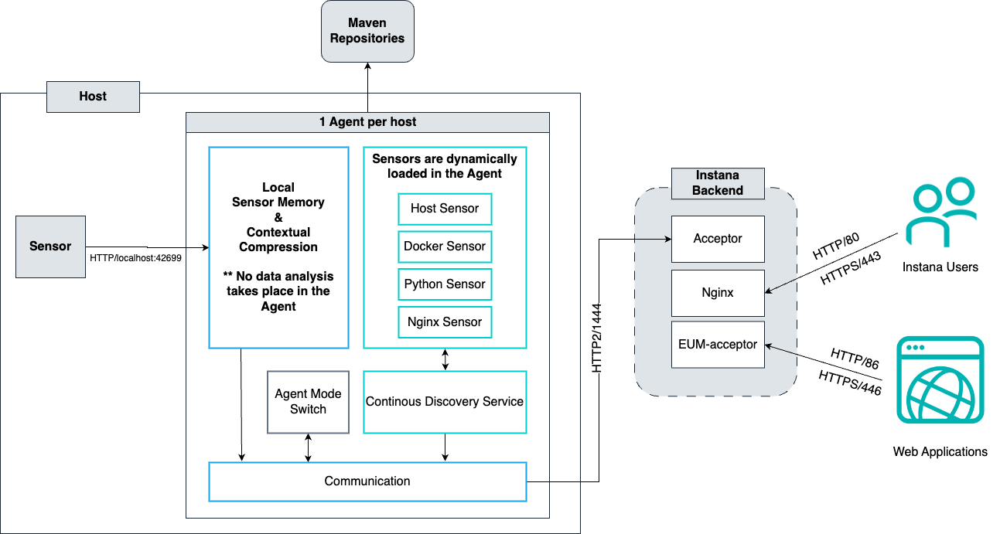
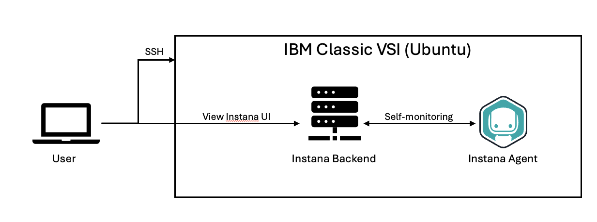
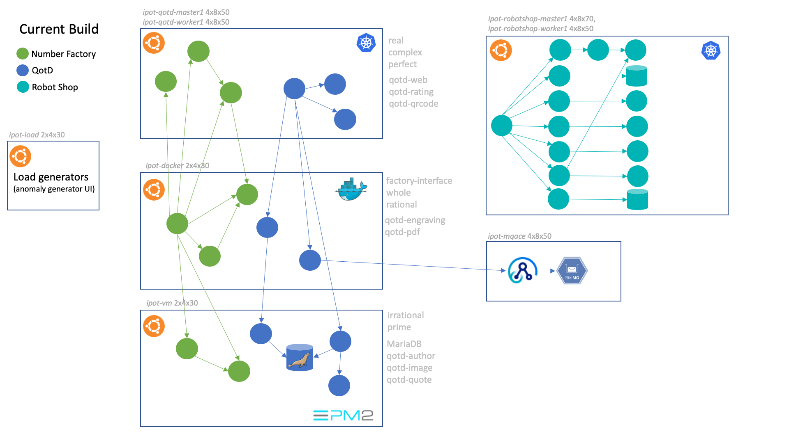
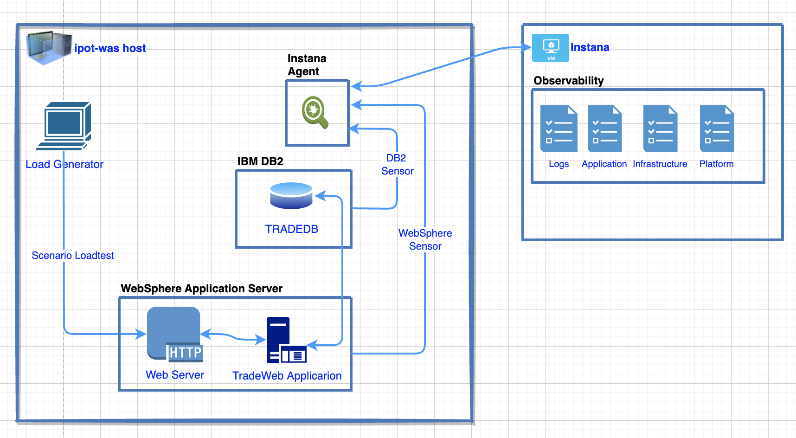
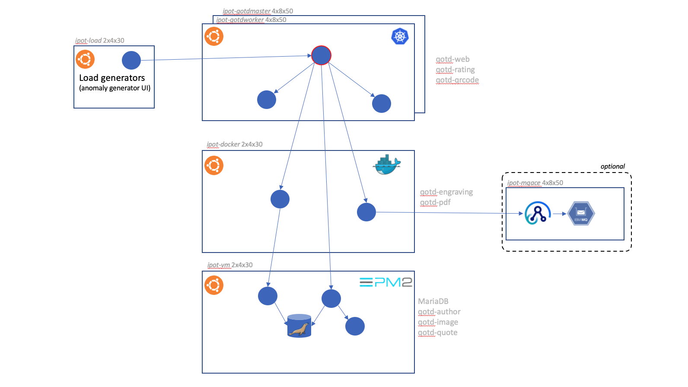

# Instana Workshop - Overview

Please Select Language

## Description

IBM Instana Workshop (**Please don't share Customer!**)

Learning how to install Instana Server (Classic Edition).

Recommend for PoX Activity, small and medium size of environment.

## Instana Server and Instana Agent overview

## Instana Backend Installation

In this lab, we will start from connect to reserved environment, install Instana Server and do self-monitoring.

## Instana Proof of Technology

### Lab 1: Cloud Native

### Lab 2: WebSphere & DB2

### Lab 3: MQ/ACE

## Next Topic

Instana Backend Installation 👉 [Click Here](../topic2/README.md)
