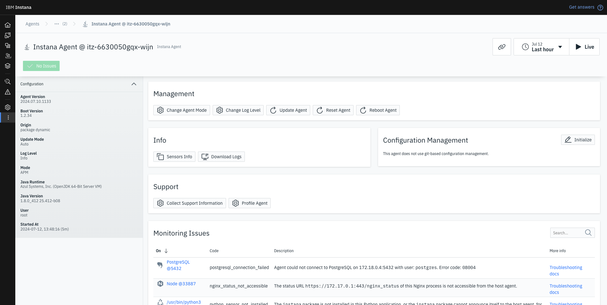

# Instana Workshop - Instana Backend Installation

Please Select Language

[](./README.md)

<!-- [](./README-th.md) -->

## Description

IBM Instana Workshop (**Please don't share Customer!**)

Learning how to install Instana Server (Classic Edition).

Recommend for PoX Activity, small and medium size of environment.

## Lab Index

0. Access Instana-Server VM 👉 [Click Here](#0-access-instana-server-vm)
1. Mount additional disk space 👉 [Click Here](#1-mount-additional-disk-space)
2. Prepare folder for IBM Instana 👉 [Click Here](#2-prepare-folder-for-ibm-instana)
3. Install Docker 👉 [Click Here](#3-install-docker)
4. Install Instana Server 👉 [Click Here](#4-install-instana-server)
5. First Login 👉 [Click Here](#5-first-login)
6. Import License 👉 [Click Here](#6-import-license)
7. Instana self-monitoring 👉 [Click Here](#7-instana-self-monitoring)
8. Tag & Zone Configuration 👉 [Click Here](#8-tag--zone-configuration)

## 0. Access Instana-Server VM

```
ssh itzuser@<PUBLIC IP> -p 2223 -i <PATH TO SSH KEY>
```

## 1. Mount additional disk space

In this lab, we will reserve environment with 1 TB additional disk. So we will mount that disk and use as IBM Instana directory.

### View disk information

```
lsblk
```


### Doing disk partition

```
sudo fdisk /dev/xvde
```


### Make file system to target disk

```
sudo mkfs -t ext4 /dev/xvde1
```

### Mount disk with `/opt` path

```
sudo mount -t ext4 /dev/xvde1 /opt
```

### File system table configuration

Append `/dev/xvde1 /opt ext4 defaults,noatime 0 0` in to file system table

```
echo "/dev/xvde1 /opt ext4 defaults,noatime 0 0" | sudo tee -a /etc/fstab
```

Check result

```
sudo cat /etc/fstab
```


## 2. Prepare folder for IBM Instana

### Create folder directory for IBM Instana

```
sudo mkdir /opt/{data,metrics,traces}
sudo mkdir /opt/log
sudo mkdir /opt/log/instana
```

## 3. Install Docker

### Uninstall all conflicting packages

```
for pkg in docker.io docker-doc docker-compose docker-compose-v2 podman-docker containerd runc; do sudo apt-get remove $pkg; done
```

### Add Docker"s official GPG key:

```
sudo apt-get update -y
sudo apt-get install -y ca-certificates curl
sudo install -m 0755 -d /etc/apt/keyrings
sudo curl -fsSL https://download.docker.com/linux/ubuntu/gpg -o /etc/apt/keyrings/docker.asc
sudo chmod a+r /etc/apt/keyrings/docker.asc
```

### Add the repository to Apt sources:

```
echo \
  "deb [arch=$(dpkg --print-architecture) signed-by=/etc/apt/keyrings/docker.asc] https://download.docker.com/linux/ubuntu \
  $(. /etc/os-release && echo "$VERSION_CODENAME") stable" | \
  sudo tee /etc/apt/sources.list.d/docker.list > /dev/null
sudo apt-get update
```

### Install the latest version

```
sudo apt-get install -y docker-ce docker-ce-cli containerd.io docker-buildx-plugin docker-compose-plugin
```

### Run `Hello World` to verify installation

```
sudo docker run hello-world
```


## 4. Install Instana Server

### Get root privileges

```
sudo -i
```

### Add Instana Console Package

```
echo 'deb [signed-by=/usr/share/keyrings/instana-archive-keyring.gpg] https://artifact-public.instana.io/artifactory/rel-debian-public-virtual generic main' > /etc/apt/sources.list.d/instana-product.list
```

Please enter download key in script before using.

```
INSTANA_DOWNLOAD_KEY=<PLEASE INSERT DOWNLOAD KEY> && /
cat << EOF > /etc/apt/auth.conf
machine artifact-public.instana.io
  login _
  password ${INSTANA_DOWNLOAD_KEY}
EOF

wget -nv -O- --user=_ --password="${INSTANA_DOWNLOAD_KEY}" https://artifact-public.instana.io/artifactory/api/security/keypair/public/repositories/rel-debian-public-virtual | gpg --dearmor > /usr/share/keyrings/instana-archive-keyring.gpg
```

```
apt update -y
apt install -y instana-console
```

Check version to verify installation

```
instana version
```

**BONUS**: We can pin version of `instana-console` to avoid getting major updates during automated upgrades

Please enter instana version in script before using.

```
INSTANA_VERSION=<INSTANA VERSION TO PIN> && \
cat > /etc/apt/preferences.d/instana-console <<EOF
Package: instana-console
Pin: version ${INSTANA_VERSION}
Pin-Priority: 1000
EOF
```

### Install IBM Instana Backend

```
instana init
```

For small installation, we will use `single` type.


```
? [What is your tenant name?] <TENANT NAME>
? [What is your unit name?] <UNIT NAME>
? [Insert your agent key (optional). If none is specified, one is generated which does not allow downloads.] <INSTANA DOWNLOAD KEY>
? [Insert your download key or official agent key (optional).] <INSTANA DOWNLOAD KEY>
? [Insert your sales key] <INSTANA SALES KEY>
? [Insert the FQDN of the host] <PUBLIC IP>.nip.io
? [Where should your data be stored?] /opt/data
? [Where should your trace data be stored?] /opt/traces
? [Where should your metric data be stored?] /opt/metrics
? [Where should your logs be stored?] /opt/log/instana
? [Path to your signed certificate file?]
? [Path to your private key file?]
```


Update Instana admin password

```
instana configure admin -p <new password>
instana update -f settings.hcl
```

## 5. First Login

Navigate to `https://<PUBLIC IP>.nip.io`.

Your can ignore first page by click `Go to Instana!`.


You will see Instana Homepage!


## 6. Import License

After install Instana Backend, you need to activate license first.

### Download license

```
sudo instana license download
```

### Import license

```
sudo instana license import -f license
```

### Check license valid date

```
sudo instana license verify
```

## 7. Instana self-monitoring

We will use Instana Agent to do self-monitoring for Instana Server.


We will use Linux Host agent due to we use `Ubuntu` as a host of Instana Server.


Wait until Instana Agent start successfully. Dashboard will show agent detail.




We recommend to change mode of agent from `APM` to `INFRA` to reduce resource usage and not nessesary to collect trace from Instana Server.


## 8. Tag & Zone Configuration

After install Instana Agent we can config zone and tag for agent.

- Custom zone are where hosts are grouped into zones on the infrastructure map.
- Custom tags enable the searching and filtering of tags in the infrastructure map.

### Config agent zone

```
sudo touch /opt/instana/agent/etc/instana/configuration-zone.yaml
```

```
INSTANA_ZONE="Instana Server" && \
cat <<EOF | sudo tee /opt/instana/agent/etc/instana/configuration-zone.yaml
# Hardware & Zone
com.instana.plugin.generic.hardware:
  enabled: true
  availability-zone: "${INSTANA_ZONE}"
EOF
```

### Config agent tags

```
sudo touch /opt/instana/agent/etc/instana/configuration-host.yaml
```

```
cat <<EOF | sudo tee /opt/instana/agent/etc/instana/configuration-host.yaml
# Host
com.instana.plugin.host:
  tags:
    - 'poc'
    - 'instana'
EOF
```


## Next Topic

Instana Proof of Technology 👉 [Click Here](./topic3/README.md)
